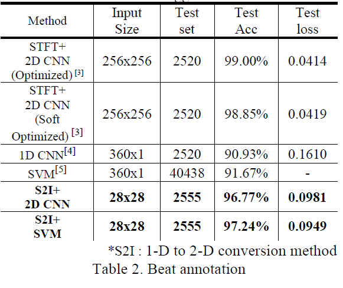

# Imaged-ECG-Signal-Processing
Arrhythmia Classification Using 1D-2D Conversion Method

# Abstract
In this study, we suggest the arrhythmia classification method using 1-D to 2-D conversion to image system. The 1-D to 2-D conversion method produces interconvertible images through simple mathematical processing of the input signal. The accuracies of the 2D CNN and SVM classifier for classifying each arrhythmia type of the 1D ECG based image were about 97.77% and 97.24% respectively using the suggested method.

# Result

Arrhythmia Classification Using 1D-2D Conversion

# On work
- Updating CNN classifier
